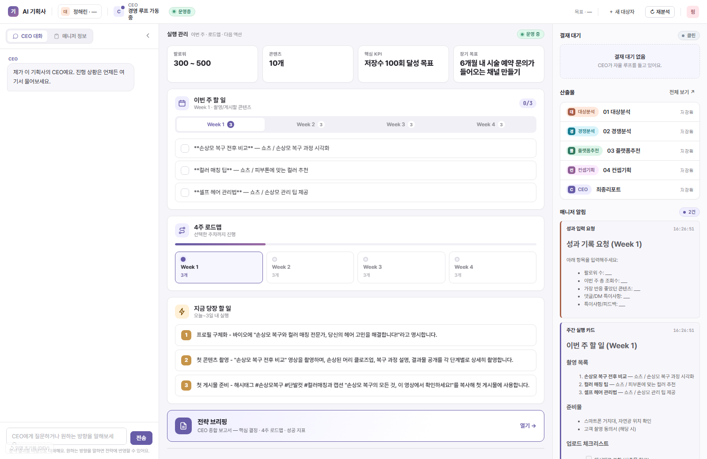
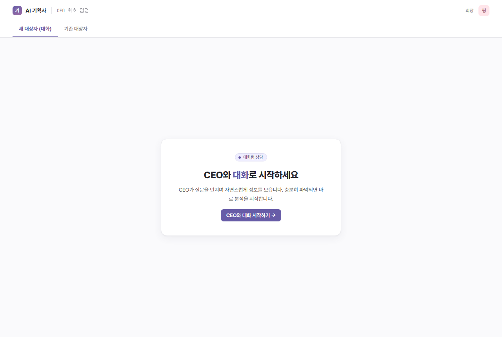

# 인플루언서 에이전트

크리에이터 한 명의 정보를 받아, AI가 **전략 분석 -> 콘텐츠 기획 -> 4주 실행 계획**까지
만들어 주고, 성과를 입력하면 전략을 다시 짜 주는 시스템.
회사 조직(회장 -> 경영 -> 부서 -> 직무)을 LLM 멀티 에이전트로 모델링했고,
프레임워크 없이 직접 구현했다.

> **만든 방식:** 문제 정의·아키텍처·기술 결정(ADR 35건)은 직접 했고, 구현은 AI를 페어
> 프로그래밍 파트너로 활용했다. 그리고 AI가 만든 코드에도 같은 검증 규율(392 테스트 ·
> 출력 검증 레이어 · 실 LLM e2e)을 그대로 적용했다 — "통과 != 검증"은 코드뿐 아니라
> AI 산출물에도.

- 언어: Python 3.11+ · 프레임워크 없음
- 생성 모델: gpt-4o · 품질 채점: Groq · 검색: Serper
- 인터페이스: CLI + 웹(FastAPI + SSE)
- 테스트: 392 passing (391 + 1 live test skipped without API key)

### 미리보기

**관리 대시보드** — 이번 주 할 일 · 4주 로드맵 · 산출물 · 매니저 알림 (실시간 SSE)



**대화형 인터뷰로 시작** (또는 `--legacy` 폼 입력)



---

## 1. 개요

1인 크리에이터는 콘텐츠를 만들지만 전략을 짜는 기획사는 없다.
이 시스템은 단일 프롬프트로 "전략 짜줘"를 호출하는 대신, **기획사의 조직 구조를 흉내 낸다.**

```
사람(회장)        목표/방향 결정, 실행(촬영·업로드), 최종 승인
   |  목표만 하달
CEO(경영)         목표 해석, 부서 임명, 결과 취합, 품질 검토, 회장 보고 판단
   |  목적+목표 할당
기획 본부(부서)    워커 오케스트레이션, 결과 정제
   |  작업 지시
직무 워커 4종      대상분석 · 경쟁분석 · 플랫폼추천 · 컨셉기획
```

상위 레이어는 "무엇을/왜"만 쥐고, 하위가 "어떻게"를 판단한다.
각 산출물은 검증 레이어(규칙 검사 + LLM 품질 채점)를 통과해야 다음 단계로 넘어간다.

> 정직한 표기: 현재 구현은 위 4계층의 **수직 슬라이스 1개**(기획 본부)다.
> 마케팅·재무·법무 본부 등 가로 확장은 설계/로드맵 상태다.
> 기본 동작은 정해진 흐름을 도는 **잘 구조화된 워크플로우**이며, 모델이 도구(워커)를
> 스스로 골라 호출하는 **옵트인 자율 루프**(CLI `--autonomous` / 웹 토글)가 병존한다(정체성 논의는 ADR 029 참조).

---

## 2. 현재 상태 — 1장(MVP) 완료, 실제 작동

아래는 전부 실행되는 기능이다.

| 기능 | 설명 |
|------|------|
| 대화형 인터뷰 | CEO가 질문을 던지며 대상자 정보 수집(이름/직업/특기/성격/타겟/SNS/목표). 폼 입력(`--legacy`)도 지원 |
| 4단계 분석 | 대상분석(강점/약점/차별점) -> 경쟁분석(포지셔닝 + 실제 구독자 수, 웹검색) -> 플랫폼추천(1·2순위 + 근거) -> 컨셉기획(컨셉 3 + 아이디어 5 + 4주 캘린더 + 촬영가이드 + 해시태그) |
| 품질 게이트 | 출력 검증(필수 섹션/이름 포함/금지표현/외래문자) + LLM 품질 채점(0~100), 미달 시 재시도 |
| 종합 리포트 | CEO가 4단계 결과를 6섹션 보고서로 종합(결론/핵심결정/강점기회/4주 로드맵/지금 할 일/KPI) |
| 실행계획 추출 | 캘린더 -> 주차별 할 일, 리포트 -> 다음 액션/KPI를 JSON으로 (`GET /api/plan/{이름}`) |
| 웹 대시보드 | 관리 중심 화면(이번 주 할 일 / 4주 로드맵 / 다음 액션) + 실시간 진행(SSE) |
| 재분석 루프 | 성과/피드백 입력 -> CEO가 어떤 분석을 다시 돌릴지 판단 -> 부분 재실행 |
| 매니저 알림 | 주간 실행 카드 / 진행 보고 / 성과 입력 요청 / 완료 요약 |

**검증 수치 (레포 확인):** 테스트 392 passing (391 + 1 live test skipped without API key) · 워커 4종 실 LLM E2E 품질 85~90/100
(대상90/경쟁85/플랫폼90/컨셉85, gpt-4o 생성 + LLM 저지 채점) · 아키텍처 결정 ADR 35건.

**최근 진행 (세션 35~39):** 도구 호출 루프 프리미티브(`call_llm_tools` + `ToolExecutor` + `agent_loop`)를
직접 구현해 모델이 분석 순서를 스스로 정하는 최소 자율 루프(`CEO.run_autonomous`)를 추가했고(선형
파이프라인과 병존), 가상 인물의 '사용자 여정' 평가(10단계 채점, 16/20 PASS)로 산출물의 실사용
실행가능성을 점검·보정했다.

---

## 3. 사용법

### 설치
```bash
pip install requests python-dotenv fastapi uvicorn
```
`.env` 에 API 키:
```
OPENAI_API_KEY=...
GROQ_API_KEY=...
SERPER_API_KEY=...
```

### CLI (src/ 기준)
```bash
cd src

python main.py                              # 대화형 인터뷰 (기본)
python main.py --legacy                     # 7필드 폼 입력
python main.py --dry-run                    # API 없이 프롬프트 파일만 출력
python main.py --reanalyze --name 김민수      # 성과/피드백 기반 재분석
python main.py --init-performance --name 김민수   # 성과기록 템플릿 생성
python main.py --init-feedback --name 김민수      # 피드백 템플릿 생성
```

### 웹
```bash
cd src
python -m uvicorn api.main:app --port 8000
# http://127.0.0.1:8000
```

### 테스트
```bash
cd src
python -m pytest -q          # 392 passing (391 + 1 live test skipped without API key)
```

### 결과물 위치
```
src/outputs/{이름}/
├── 산출물/
│   ├── 01_대상분석.md  02_경쟁분석.md  03_플랫폼추천.md  04_컨셉기획.md
│   └── 최종리포트.md          (6섹션 종합)
├── 인수인계/
├── 성과기록.md / 피드백.md     (재분석 입력용 — 1차 실행 후 자동 생성)
└── .system/                   (CEO 상태/계획, 에이전트 작업, 보고 이력, 로그)
```

---

## 4. 프로젝트 구조

```
src/
├── main.py                 진입점 (인터뷰 / legacy / reanalyze / dry-run)
├── core/                   인프라
│   ├── llm_client.py         LLM 호출 (provider 라우팅 + 폴백 + 캐시)
│   ├── interview_engine.py   대화형 인터뷰
│   ├── file_manager.py       산출물/버전/성과기록 저장
│   ├── plan_extractor.py     캘린더/액션/KPI 추출
│   ├── report_builder.py     리포트/브리핑 조립
│   ├── scheduler.py          에이전트 의존성 DAG 실행
│   └── serper_client.py      경쟁 분석 웹검색
├── agents/                 에이전트 레이어
│   ├── ceo.py                경영(오케스트레이션)
│   ├── manager.py            매니저(주간 카드/알림)
│   ├── subject/competition/platform/concept_*.py   직무 워커 4종
│   ├── agent_context.py      스코프별 컨텍스트 전달
│   └── __init__.py           Agent Registry (SSoT)
├── departments/planning.py 기획 본부 (부서 레이어)
├── validators/             출력 검증
├── api/                    웹 (FastAPI + SSE) + 정적 프론트(MVC)
├── prompts/                시스템 프롬프트
└── knowledge/              판단 근거 지식(선택 주입)
```

설계 문서: `docs/workflow/`(단계별) · `docs/adr/`(결정 35건) · `docs/review/`(세션 회고)

---

## 5. 향후 발전 계획 — 2장 (실적용으로 확장)

1장은 "전략을 만든다"까지다. 2장의 목표는 **실제 미용사 1명에게 적용해 성과로 검증하는 것**.
기술 확장보다 실사용 검증이 우선이다.

| 우선순위 | 항목 | 내용 |
|:---:|------|------|
| 1 | 측정·실험 설계 | KPI + 콘텐츠 변수 태깅(주제/빈도/시간대/형식) -> 성과 귀속 + 의사결정 로그 |
| 2 | 컨시어지 적용 | 운영자(개발자)가 시스템을 돌리고 미용사는 결과를 받는 방식으로 4주 운영 |
| 3 | 최소 자율 루프 | 성과 데이터를 보고 다음 행동을 스스로 결정하는 도구 호출 루프(1장을 도구로 감쌈) |
| 4 | 판단 검증(트랙0) | CEO의 LLM 판단이 조용히 폴백하지 않는지 계측 |

**성공 기준(2축):** (실사용) 실제 팔로워 성장 · (검증) 측정 가능한 실험 설계 + 의사결정 로그.
"데이터가 쌓이면 검증된다"가 아니라 "통제된 실험이 검증을 만든다"는 원칙으로 cross-AI 리뷰(Claude+GPT)를 거쳐 확정.

상세: `docs/workflow/2장_에이전트하네스/`, `docs/1장_졸업선언.md`

---

## 6. 진행 상황

| 단계 | 상태 |
|------|------|
| 인터뷰 + 4단계 분석 파이프라인 | 완료 |
| 품질 게이트(검증 + LLM 저지) | 완료 |
| 6섹션 종합 리포트 + 실행계획 추출 | 완료 |
| 웹 대시보드(관리 중심 + SSE) | 완료 |
| 재분석 루프 + 매니저 알림 | 완료 |
| 측정·실험 레이어 | 완료 (core/measure.py — KPI·변수태깅·의사결정 provenance) |
| 컨시어지 실적용(미용사 1명, 4주) | 준비 중 |
| 최소 자율 관리 루프 | 구현 + 제품 연결 (CLI `--autonomous` / 웹 토글, 선형과 병존) |
| 다부서 가로 확장 / Cross-review | 로드맵 |

> 개발 방식: 문제 정의·설계·기술 결정은 직접 하고, 코드는 AI 협업으로 작성했으며,
> 주요 결정은 ADR 35건으로 근거를 남겼다.
